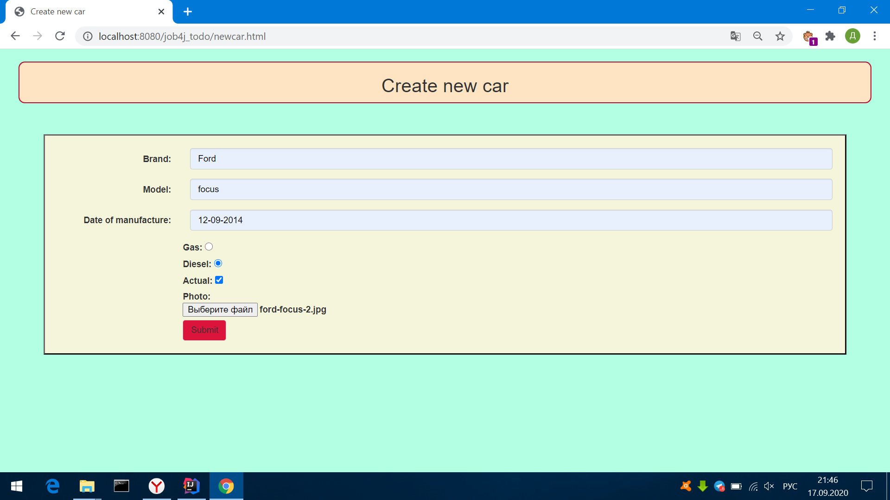

Web приложение - площадка машин.
В данном приложении доступна регистрация и аутентификация пользователей, также реализован гостевой вход. 
Каждый пользователь имеет возможность выставить автомобиль на продажу.
В приложении реализованы фильтры:
- вывод объявлений за последние сутки
- вывод объявлений только с фотографиями автомобилей
- вывод объявлений определенной марки.

Технологии которые были применены для разработки данного приложения:
- JQuery, Ajax
- Maven
- Tomcat
- Servlet
- Hibernate
- Travis
- Jacoco
- PostgreSQL
- Java 14

- Регистрация пользователя

- Авторизация аутентификация пользователя

- Добавление нового объявления

- Вывод всех объявлений о продаже

